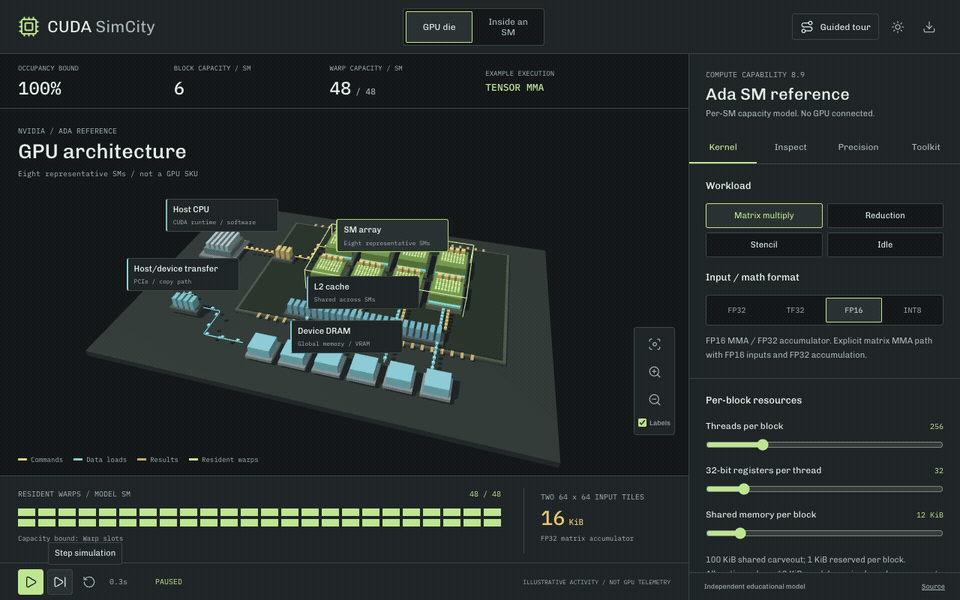

# CUDA SimCity

An interactive 3D explainer for CUDA-style parallel execution. Adjust block size, register pressure, and shared-memory use to see how an educational occupancy model changes active warps across a city of streaming multiprocessors.



This is an independent educational preview, not GPU telemetry or a hardware benchmark. Published Ada limits inform a simplified per-SM capacity bound; register-allocation granularity and partition constraints are omitted. Kernel activity remains illustrative, and the city does not execute CUDA.

The [benchmark roadmap](docs/benchmark-roadmap.md) separates implemented behavior from proposed features and records the verification limits.

## Development

```bash
npm ci
npm run dev
npm test
npm run typecheck
npx playwright install chromium
npm run test:browser
npm run build
```